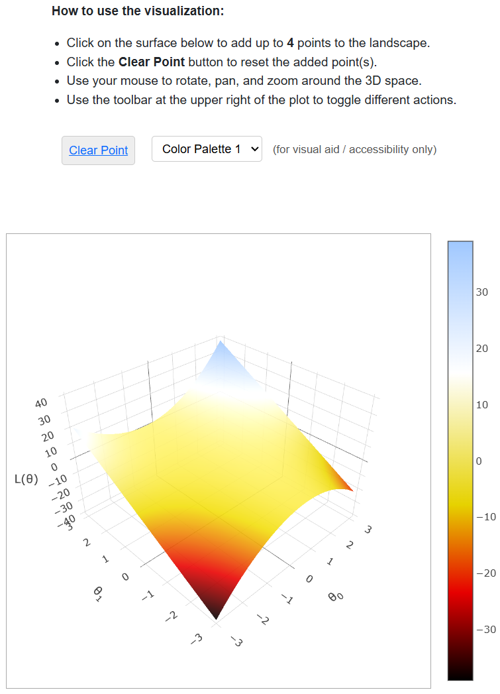

# PrairieLearn OER Element: Truth Table

This element was developed by James Geronimo, Malavikha Sudarshan, and Sean Lim. Please carefully test the element and understand its features and limitations before deploying it in a course. It is provided as-is and not officially maintained by PrairieLearn, so we can only provide limited support for any issues you encounter!

If you like this element, you can use it in your own PrairieLearn course by copying the contents of the `elements` folder into your own course repository. After syncing, the element can be used as illustrated by the example question that is also contained in this repository.


## `pl-interactive-visualizer` element

This element creates a three-dimensional plot that users can rotate, zoom, and place points on, and can be used for both instructional materials and questions. The number of points that can be placed at once is fixed to 4, and this feature can be toggled on or off by the instructor. The inputted function must be some mathematical expression containing `x` and `y`. Apart from basic arithmetic, the expression supports the following operations: `sin`, `cos`, `tan`, `exp`, `log`, `sqrt`, `pow`, `abs`, `min`, and `max`. This visualizer is a decorative element.

### Example



```html
<pl-interactive-visualizer 
    function="3*x+x**2*y+y" 
    place="true">
</pl-interactive-visualizer>
```

### Element Attributes

| Attribute | Type | Description |
|-----------|------|-------------|
| `function` | string (required) | The two-variable function containing `x` and `y` that is to be plotted. It should be formatted like a Python math expression and supports basic arithemtic operations. Additionally, the following operations are supported: `sin`, `cos`, `tan`, `exp`, `log`, `sqrt`, `pow`, `abs`, `min`, and `max`. |
| `place` | boolean (default: `true`) | If set to `true`, users are able to place up to 4 points on the graph. This also renders the appropriate instructions and "Clear Point" button to clear all points. Otherwise, users cannot place down points, and the instructions and "Clear Point" button are not rendered. |