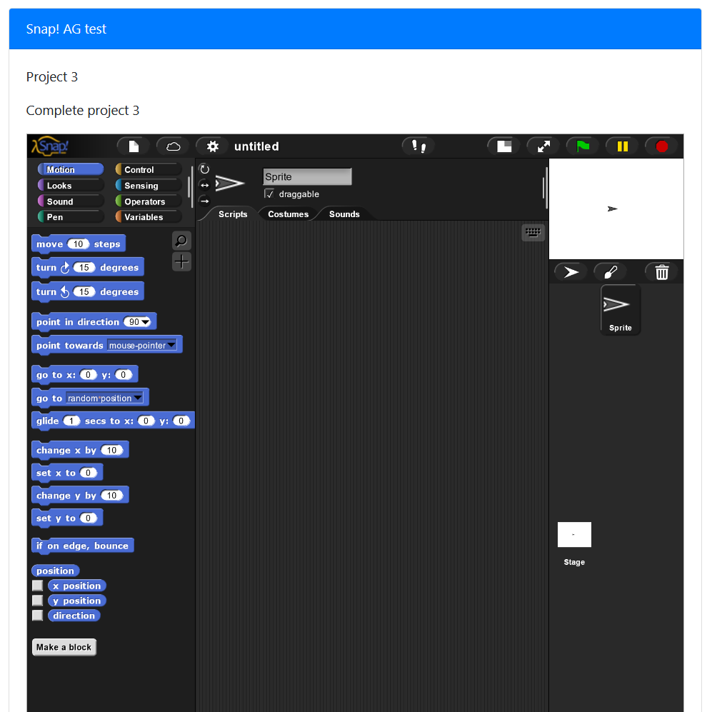
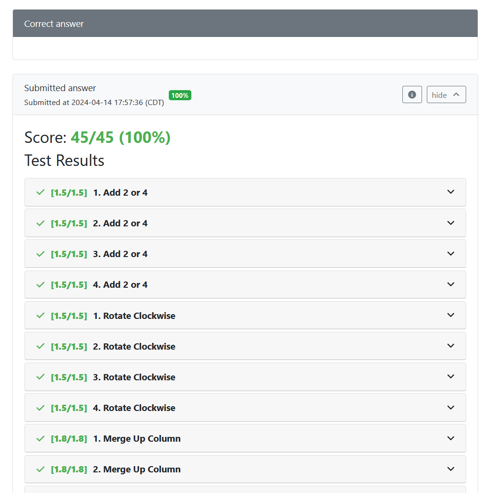

Question authoring:
1.	Example info.json: 
```json 
    {
    "uuid": "8b4891d6-64d1-4e89-b72d-ad2133f25b2f",
    "title": "Snap! AG test",
    "topic": "Algebra",
    "tags": ["mwest", "fa17", "tpl101", "v3"],
    "type": "v3",
    "singleVariant": true,
    "gradingMethod": "External",
        "externalGradingOptions": {
        "enabled": true,
        "image": "localhost:5000/snap-test-new",
        "entrypoint": "/usr/src/cache/run_autograder",
        "timeout": 60,
        "enableNetworking": true
        }
    }

    Key points:
        a.	gradingMethod needs to be External
        b.	externalGradingOptions:
            -	enabled must be true
            -	image points to the autograder docker image
            -	entrypoint runs the “run_autograder” script

2.	question.html:
    - pl-snap has two attributes:
        a.	source-file-name: name of the base snap file to load, if not provided Snap! will load a blank/new project
        b.	directory: where the source file is located, defaults to clientFilesQuestion.
    
    

    - Use the pl-submission panel and pl-external-grader-results to show the graded results:
    <pl-submission-panel>
        <pl-external-grader-results></pl-external-grader-results>
    </pl-submission-panel>  

    

3.	tests/autograder.xml: the Snap! autograder file written in Snap!.

example question can be found in the questions folder titled "snapAGTest"

slide deck: https://docs.google.com/presentation/d/1BwPL89MBC4caneVTdlYTDNYEt6iKgTiVnVo13djyIS8/edit#slide=id.g28ecd103568_0_273 

code author: James Rakanatha Yosharry Litanto